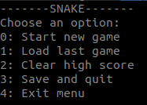
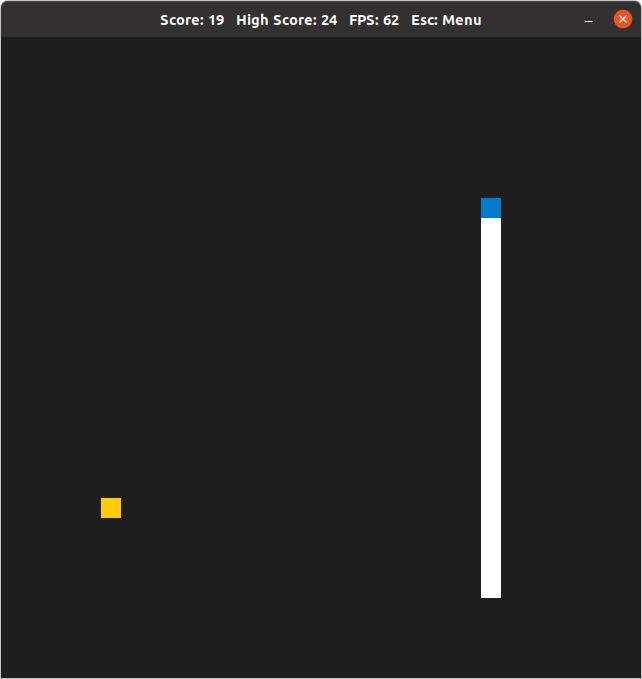

# CPPND: Capstone Snake Game

This is a game of Snake implemented for the Capstone project in the [Udacity C++ Nanodegree Program](https://www.udacity.com/course/c-plus-plus-nanodegree--nd213). The code for this repo was inspired by [this](https://codereview.stackexchange.com/questions/212296/snake-game-in-c-with-sdl) excellent StackOverflow post and set of responses.

## Dependencies for Running Locally
* cmake >= 3.7
  * All OSes: [click here for installation instructions](https://cmake.org/install/)
* make >= 4.1 (Linux, Mac), 3.81 (Windows)
  * Linux: make is installed by default on most Linux distros
  * Mac: [install Xcode command line tools to get make](https://developer.apple.com/xcode/features/)
  * Windows: [Click here for installation instructions](http://gnuwin32.sourceforge.net/packages/make.htm)
* SDL2 >= 2.0
  * All installation instructions can be found [here](https://wiki.libsdl.org/Installation)
  * Note that for Linux, an `apt` or `apt-get` installation is preferred to building from source.
* gcc/g++ >= 5.4
  * Linux: gcc / g++ is installed by default on most Linux distros
  * Mac: same deal as make - [install Xcode command line tools](https://developer.apple.com/xcode/features/)
  * Windows: recommend using [MinGW](http://www.mingw.org/)

## Basic Build Instructions

1. Clone this repo.
2. Make a build directory in the top level directory: `mkdir build && cd build`
3. Compile: `cmake .. && make`
4. Run it: `./SnakeGame`.

## Game Play
1. Start the game with `./SnakeGame`from a terminal. A menu is displayed:

    
2. Choose one of the options by typing the corresponding number.
3. In case (1: Load last game) is chosen, the game tries to load the last saved game. If unsuccessful, a new game is started.
4. The game starts in paused mode. Press one of the arrow keys to start.
    
    
5. Try to beat the high score! The high score is saved at the end of the game.
6. Press **Esc** to show the menu. The menu is displayed in the terminal. The game is paused.
7. The game can be saved on exit if the snake is alive. To exit without saving, press **CTRL+C** during game play.

## File Structure
```
── src
    ├── controller.cpp: Implementation of Controller class.
    ├── controller.h: Responsible for handling keyboard input during gameplay
    ├── food.cpp: Implementation of Food class.
    ├── food.h: Inherits from GameComponent class. Food is generated randomly in each game loop.
    ├── game_component.h: Virtual base class for componenets of the game that are updated and rendered in tehh game loop. Holds the pointer to the renderer of the parent Game class.
    ├── game.cpp: Implementation of game class
    ├── game.h: The Game class consists of a renderer, controller and game componenets such (snake and food). Controlls the game loop, updates food and snake, displays a menu when called, and optionally saves the game on                                          exit.
    ├── main.cpp: Initializes renderer and controller, starts the game. Displays the score on termination.
    ├── renderer.cpp: Implementation of the Renderer class.
    ├── renderer.h: The renderer class creates the game window and renders the game componenets. The title window shows the current score, high score, fps, keyboard shortcut for the Menu.
    ├── snake.cpp: Implementation of the Snake class."
    └── snake.h: The snake class inherits from the GameComponent class and consists of a head, body and other snake attributes.
```


## Rubric Points Addressed

### README (All Rubric Points REQUIRED)
1. A README with instructions is included with the project
2. The README indicates which project is chosen.
3. The README includes information about each rubric point addressed.

### Compiling and Testing (All Rubric Points REQUIRED)
The submission must compile and run.

### Loops, Functions, I/O

1. The project demonstrates an understanding of C++ functions and control structures.
    * A variety of control structures are used in the project.
* The project code is clearly organized into functions.
2. The project reads data from a file and process the data, or the program writes data to a file.
    * The project reads data from an external file or writes data to a file as part of the necessary operation of the program.
3. The project accepts user input and processes the input.
    * The project accepts input from a user as part of the necessary operation of the program.

### Object Oriented Programming
1. The project uses Object Oriented Programming techniques.
    * The project code is organized into classes with class attributes to hold the data, and class methods to perform tasks.
2. Classes use appropriate access specifiers for class members.
    * All class data members are explicitly specified as public, protected, or private.
3. Class constructors utilize member initialization lists.
    * All class members that are set to argument values are initialized through member initialization lists.
4. Classes encapsulate behavior.
    * Appropriate data and functions are grouped into classes. Member data that is subject to an invariant is hidden from the user. State is accessed via member functions.
5. Classes follow an appropriate inheritance hierarchy.
    * Inheritance hierarchies are logical. Composition is used instead of inheritance when appropriate. Abstract classes are composed of pure virtual functions. Override functions are specified.
6. Derived class functions override virtual base class functions.
    * One member function in an inherited class overrides a virtual base class member function.

### Memory Management
1. The project makes use of references in function declarations.
    * At least two variables are defined as references, or two functions use pass-by-reference in the project code.
2. The project uses smart pointers instead of raw pointers.
    * The project uses at least one smart pointer: unique_ptr, shared_ptr, or weak_ptr. The project does not use raw pointers.

## Rubric Points Not Addressed

### Object Oriented Programming
1. Classes abstract implementation details from their interfaces.
    * All class member functions document their effects, either through function names, comments, or formal documentation. Member functions do not change program state in undocumented ways.
2. Overloaded functions allow the same function to operate on different parameters.
    * One function is overloaded with different signatures for the same function name.
3. Templates generalize functions in the project.
    * One function is declared with a template that allows it to accept a generic parameter.

### Memory Management
1. The project uses destructors appropriately.
    * At least one class that uses unmanaged dynamically allocated memory, along with any class that otherwise needs to modify state upon the termination of an object, uses a destructor.
2. The project uses scope / Resource Acquisition Is Initialization (RAII) where appropriate.
    * The project follows the Resource Acquisition Is Initialization pattern where appropriate, by allocating objects at compile-time, initializing objects when they are declared, and utilizing scope to ensure their automatic destruction.
3. The project follows the Rule of 5.
    * For all classes, if any one of the copy constructor, copy assignment operator, move constructor, move assignment operator, and destructor are defined, then all of these functions are defined.
4. The project uses move semantics to move data, instead of copying it, where possible.
    * For classes with move constructors, the project returns objects of that class by value, and relies on the move constructor, instead of copying the object.

## Concurrency
1. The project uses multithreading.
    * The project uses multiple threads in the execution.
2. A promise and future is used in the project.
    * A promise and future is used to pass data from a worker thread to a parent thread in the project code.
3. A mutex or lock is used in the project.
    * A mutex or lock (e.g. std::lock_guard or `std::unique_lock) is used to protect data that is shared across multiple threads in the project code.
4. A condition variable is used in the project.
    * A std::condition_variable is used in the project code to synchronize thread execution.
